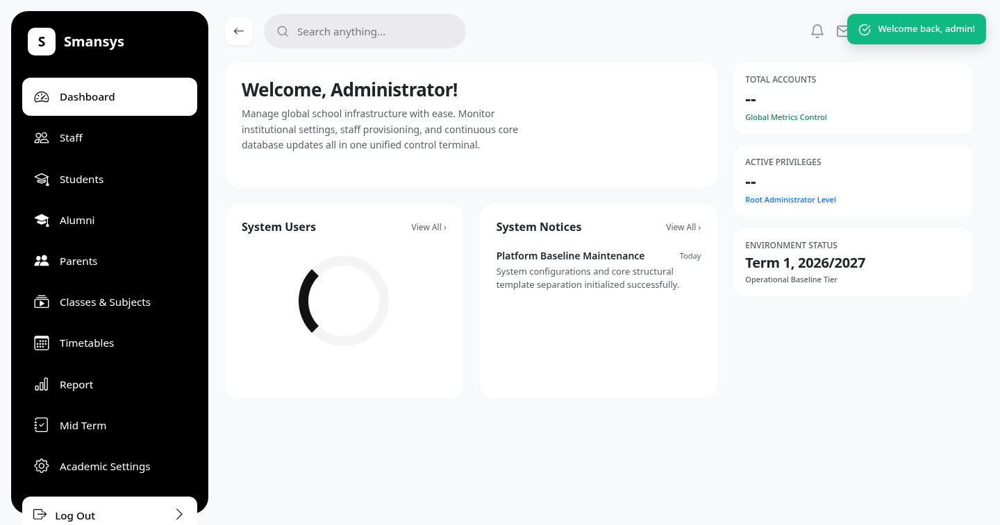
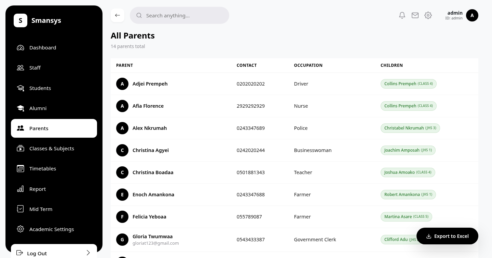
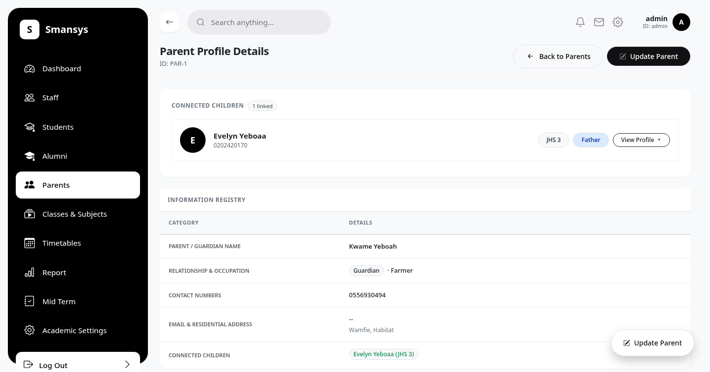
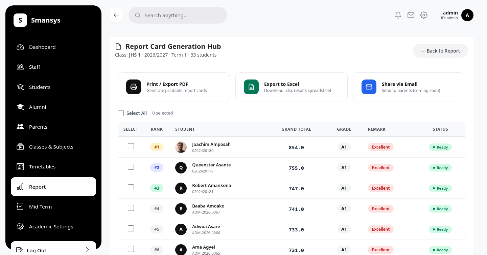

<div align="center">

# 🏫 Smansys — School Management System

An offline-first, modern school operations and administrative platform designed for private schools.

[](#)
[](#)
[](#)

</div>

---

## 🌟 Key Features

* **📊 Interactive Admin Dashboard:** Real-time metrics for student enrollment, male/female distribution, and subject breakdown.
* **👨‍👩‍👧 Parent & Student Directory:** Unified family links with instant visibility into connected students and classes.
* **📄 Report Card Generator:** Custom print-ready result slips with page-break controls and school branding headers.
* **🎓 Promotion Portal:** Automated grade-level promotion logic with safeguards against accidental data drifts.

---

## 🖼️ Application Showcase

<table>
  <tr>
    <td width="50%">
      <h3 align="center">Admin Dashboard</h3>
      
    </td>
    <td width="50%">
      <h3 align="center">Parent Directory</h3>
      
    </td>
  </tr>
  <tr>
    <td width="50%">
      <h3 align="center">Parent Profile & Linked Students</h3>
      
    </td>
    <td width="50%">
      <h3 align="center">Printable Report Card</h3>
      
    </td>
  </tr>
</table>

---

## 🛠️ Tech Stack

* **Backend:** Python, Django
* **Frontend:** HTML5, Tailwind CSS, JavaScript (Lottie Animations)
* **Database:** SQLite (Development) / PostgreSQL (Production)

---

## 🚀 Quickstart Guide

1. **Clone the repository:**
   ```bash
   git clone [https://github.com/xluljoey/School-Management-System.git](https://github.com/xluljoey/School-Management-System.git)
   cd School-Management-System
